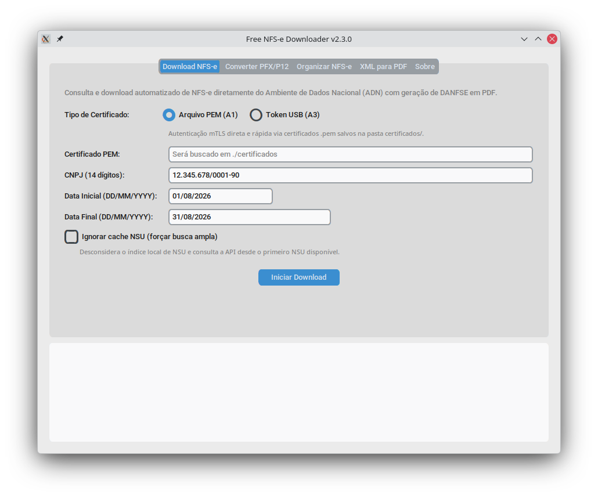

# Free NFS-e Downloader (v2.3.1)

[](https://github.com/CassioAug/free-nfse-downloader/actions/workflows/ci.yml)
[](https://github.com/CassioAug/free-nfse-downloader/releases)
[](https://www.gnu.org/licenses/gpl-3.0)

O **Free NFS-e Downloader** é uma ferramenta gratuita e de código aberto para consulta, sincronização e download automatizado em lote de **Notas Fiscais de Serviços Eletrônicas (NFS-e)** no padrão nacional da Receita Federal (Ambiente de Dados Nacional - ADN).

O sistema obtém os arquivos **XML** oficiais diretamente da API governamental e gera relatórios visuais **PDF (DANFSE)** de cada nota, sem necessidade de digitação de captchas e sem cobrança de mensalidades.

---

## Interface do Aplicativo



---

## Recursos Principais

- **Download Automatizado via ADN:** Conexão direta com o endpoint de distribuição DFe da Receita Federal (`/contribuintes/DFe/{NSU}`).
- **Geração Automática de DANFSE:** Converte os arquivos XML baixados em relatórios PDF no formato DANFSE nacional.
- **Classificação Automática de Notas:** Separa automaticamente arquivos em pastas de **serviços prestados** (empresa como emitente) e **serviços tomados** (empresa como tomadora).
- **Busca Temporal por Período:** Localiza o intervalo de NSUs (Número Sequencial Único) a partir de datas informadas (`DD/MM/YYYY`), utilizando busca binária inteligente com cache local.
- **Suporte a Certificados Digitais:** Compatível com certificados **A1** (arquivos `.pfx` ou `.pem`) e **A3** (tokens USB e cartões no Windows).
- **Utilitários Integrados:**
  - Conversão de certificados A1 (`.pfx` / `.p12`) para `.pem` sem senha para uso mTLS.
  - Conversão offline em lote de arquivos XML para PDF.
  - Reorganização e classificação de arquivos XML já existentes no disco.
- **Privacidade e Segurança:** Execução 100% local. Certificados, chaves privadas e notas fiscais não são compartilhados com servidores de terceiros ou serviços em nuvem.

---

## Instalação e Configuração

### Pré-requisitos

- **Python 3.8 ou superior:** [python.org/downloads](https://www.python.org/downloads/)  
  *(No Windows, marque a opção "Add Python to PATH" durante a instalação).*
- **No Linux (Tkinter):**
  - Debian / Ubuntu / Mint: `sudo apt install python3-tk python3-venv`
  - Arch Linux / Manjaro: `sudo pacman -S tk`
  - Fedora: `sudo dnf install python3-tkinter`

### Instalação Automática

1. Baixe o pacote compactado da versão mais recente na página de **[Releases](https://github.com/CassioAug/free-nfse-downloader/releases)** e extraia em uma pasta de sua preferência.
2. Execute o script de instalação de dependências:
   - **Windows:** Dê dois cliques em `instalar_dependencias.bat`.
   - **Linux:** No terminal, execute `./instalar_dependencias.sh`.

O script criará o ambiente virtual isolado (`.venv`) e instalará todas as bibliotecas necessárias automaticamente.

---

## Utilização via Interface Gráfica (GUI)

Para abrir o aplicativo:
- **Windows:** Dê dois cliques em `iniciar_gui.bat`.
- **Linux:** Execute `./iniciar_gui.sh`.

### Abas da Aplicação

#### 1. Download NFS-e
Consulta e baixa as notas fiscais emitidas ou recebidas no período especificado.
- **Tipo de Certificado:**
  - *Arquivo PEM (A1):* Autenticação mTLS direta de alta performance. Requer arquivo `.pem` salvo na pasta `certificados/`.
  - *Token USB (A3):* Autenticação com token físico ou cartão via Windows Certificate Store e navegador integrado (exclusivo para Windows).
- **Certificado PEM / Índice do Token:** Especifica o nome do arquivo `.pem` em `certificados/` ou o índice do token detectado.
- **CNPJ:** 14 dígitos numéricos da empresa consultada. Se deixado em branco, o sistema tenta identificá-lo automaticamente no certificado.
- **Data Inicial e Data Final:** Período no formato `DD/MM/YYYY`. Se a data final for omitida, a data atual é utilizada.
- **Ignorar cache NSU:** Quando marcado, desconsidera o índice local salvo em `cache_nsu/` e varre a API desde o primeiro NSU disponível (recomendado caso suspeite de notas pendentes anteriores ao cache).

#### 2. Converter PFX/P12
Converte certificados digitais A1 (`.pfx` ou `.p12`) para arquivos `.pem` sem senha, formato exigido para conexões mTLS pelo módulo Python.
- **Arquivo PFX/P12:** Caminho do arquivo original do certificado.
- **Senha do Certificado:** Senha de proteção do arquivo `.pfx`.
- **Arquivo PEM (Saída):** Caminho de destino (opcional; por padrão, salva em `./certificados/<nome>.pem`).

#### 3. Organizar NFS-e
Classifica arquivos XML locais que já foram baixados, movendo-os para subpastas conforme o papel da empresa na nota fiscal.
- **Pasta dos XMLs:** Diretório onde estão os arquivos XML.
- **CNPJ:** CNPJ de 14 dígitos utilizado como referência para separar prestados de tomados.

#### 4. XML para PDF
Converte arquivos XML de NFS-e salvos localmente em relatórios DANFSE (PDF) sem necessidade de acesso à internet.
- **XML ou Pasta:** Caminho de um arquivo XML específico ou de uma pasta inteira.
- **Pasta Destino (Opcional):** Diretório de saída dos PDFs (se omitido, salva na mesma pasta do XML de origem).
- **Forçar conversão:** Sobrescreve PDFs já gerados anteriormente.

---

## Utilização via Linha de Comando (CLI)

Todos os recursos do aplicativo podem ser executados diretamente no terminal para integração com scripts agendados ou rotinas de servidores:

### 1. Download de Notas Fiscais
```bash
# Execução interativa padrão
python src/download_nfse.py

# Download ignorando o cache local de NSUs
python src/download_nfse.py --ignorar-cache
```

O utilitário solicitará o tipo de certificado, a seleção do arquivo ou token e as datas inicial e final.

### 2. Conversão de Certificado A1 (PFX para PEM)
```bash
# Modo interativo (lista certificados em ./certificados)
python src/convert_pfx.py

# Modo direto via argumentos
python src/convert_pfx.py ./certificados/empresa.pfx "senha123" ./certificados/empresa.pem
```

### 3. Reorganização de XMLs Locais
```bash
python src/organize_nfse.py --dir ./notas_fiscais/12345678000199 --cnpj 12345678000199
```

### 4. Geração em Lote de DANFSE em PDF
```bash
# Converte todos os XMLs pendentes na pasta padrão (notas_fiscais/)
python src/xml_to_pdf.py

# Converte uma pasta específica e força a substituição de PDFs existentes
python src/xml_to_pdf.py ./notas_fiscais/12345678000199/prestados -f

# Converte um único arquivo XML
python src/xml_to_pdf.py ./notas_fiscais/NFSe_exemplo.xml -o ./saida_pdfs
```

Para mais detalhes sobre flags de comando e integração em lote, consulte [docs/cli.md](docs/cli.md).

---

## Estrutura de Arquivos e Diretórios

```
free-nfse-downloader/
├── cache_nsu/              # Cache local de indexação de NSUs por data
├── certificados/           # Pasta destinada a certificados .pem e .pfx
├── docs/                   # Documentação detalhada e capturas de tela
│   ├── arquitetura.md      # Funcionamento do mTLS, NSUs e paginação
│   └── cli.md              # Guia de comandos de terminal
├── notas_fiscais/          # Diretório padrão de saída das notas fiscais
│   └── <CNPJ_CONSULTADO>/
│       ├── prestados/      # Notas emitidas pela empresa consultada (XML e PDF)
│       ├── tomados/        # Notas recebidas de fornecedores (XML e PDF)
│       └── sem_data/       # Eventos fiscais auxiliares (cancelamentos, etc.)
└── src/                    # Código-fonte do projeto
```

---

## Documentação Técnica

Para compreender detalhes de implementação da API governamental, mTLS, limites de requisições e paginação de NSU:
- [Guia de Uso CLI](docs/cli.md)
- [Arquitetura e Protocolo ADN](docs/arquitetura.md)

---

## Licença

Este projeto é software livre sob a licença **GNU General Public License v3.0**. Consulte o arquivo [LICENSE](LICENSE) para termos e condições.
